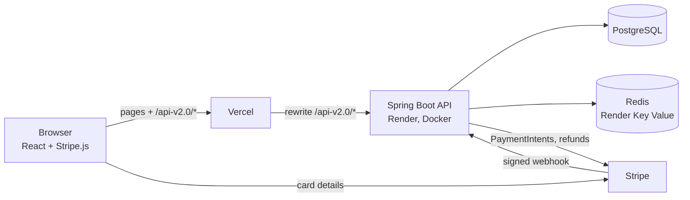
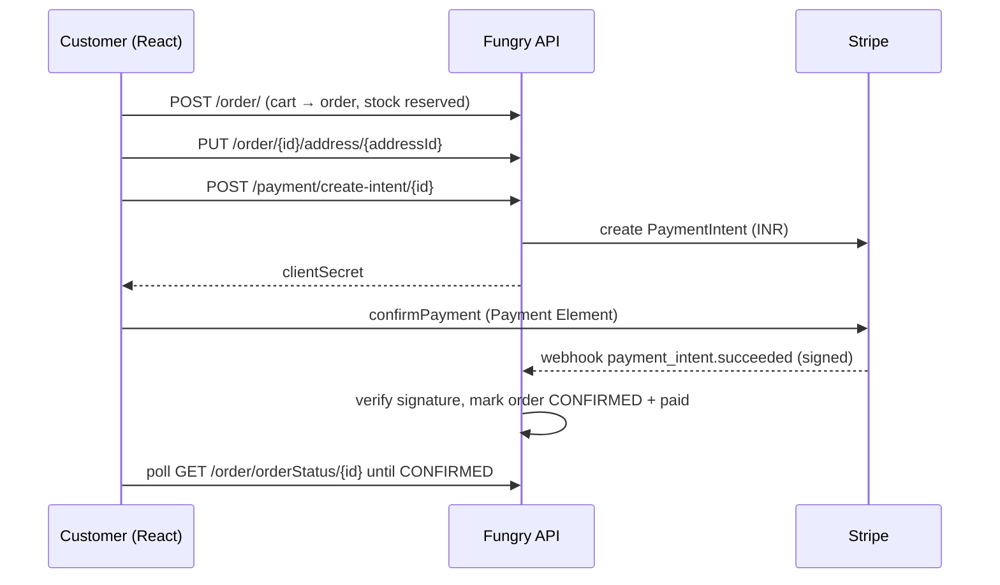

# 🍔 Fungry

A food ordering platform with separate apps for customers, restaurant owners and admins. It's built with a Spring Boot backend and a React frontend. Stripe handles card payments, Redis caches the busiest reads, and a scheduled job cancels unpaid orders.

**Live:** [fungry-official.vercel.app](https://fungry-official.vercel.app) (frontend on Vercel, API on Render's free tier, so the first request after a quiet spell can take up to a minute while the backend wakes up)

---

## What it does

| Role | Can do |
|---|---|
| **Customer** | Browse restaurants (paginated, sortable) and their menus, rate restaurants, keep a cart, manage delivery addresses, check out with card (Stripe) or cash on delivery, track and cancel orders, see order history |
| **Restaurant owner** | Edit restaurant details, add, update and remove menu items and stock, and move incoming orders through *Confirmed → Preparing → Out for delivery → Delivered* |
| **Admin** | List and filter users by role, edit users, view any user's order history, and create restaurants for owners through the API (`POST /restaurant/{ownerId}`); an owner without a restaurant sees an onboarding screen |

## Engineering highlights

**Order placement is transactional and doesn't trust the client.**
Placing an order runs inside one transaction. It checks every item's stock, reserves the quantities and recalculates the total from current menu prices on the server. If any item is short, the whole thing rolls back. A cart can only hold items from one restaurant.

**Order status follows a strict lifecycle.**
`CREATED → CONFIRMED → PREPARING → OUT_FOR_DELIVERY → DELIVERED`, with `CANCELED` as the only exit. The backend rejects skipped or backward transitions. Owners can't touch an order until it's paid or confirmed as cash on delivery, and delivered or canceled orders are final.

**Stripe payments confirmed by webhook.**
- **Payment:** the backend creates a PaymentIntent (reusing an open one if the customer retries) and the frontend collects the card with Stripe's Payment Element.
- **Confirmation:** the order is marked paid only when the signed `payment_intent.succeeded` webhook arrives, never on the browser's word. The handler checks the signature, ignores duplicate deliveries, and flags payments that arrive for orders that are no longer awaiting payment.
- **Waiting:** meanwhile, the checkout page polls the order status and moves on once the webhook has confirmed it.

**Cancellations, refunds and stale orders.**
- **Cancel:** customers can cancel before the kitchen starts preparing. Paid orders are refunded through Stripe automatically, and reserved stock goes back on the menu.
- **Stale orders:** a `@Scheduled` job runs every minute and cancels orders left unpaid for 10 minutes, releasing their stock.

**Redis caching that fails safe.**
- **What's cached:** restaurant lists, restaurant details, menus (per sort order) and user lookups, using Spring Cache on Redis with a 10-minute TTL. Writes evict the affected entries.
- **Serialization:** values are stored as JSON, and only the project's own model, DTO and enum classes (plus standard collections) are allowed back out.
- **Outages:** if Redis is unreachable, the cache error is logged and the request is served from PostgreSQL instead of failing.

**Security.**
- **Login:** Spring Security with server-side sessions and BCrypt-hashed passwords.
- **Ownership checks:** orders, addresses, restaurants and menu items are checked against the logged-in user, so you can't read or change someone else's data by changing an ID in the URL.
- **Errors:** a global exception handler returns consistent JSON errors, including a JSON 401 for unauthenticated calls.
- **Secrets:** Stripe keys and database credentials come from environment variables and are never committed.

**Deployment.**
- **Backend image:** a multi-stage Docker build compiles with Maven and ships only a JRE-Alpine image that runs as a non-root user.
- **Hosting:** the frontend is on Vercel, which forwards `/api-v2.0/*` to the backend, so the browser talks to a single origin and the session cookie stays first-party. The backend and Redis run on Render.

## Architecture



### Card payment flow



## Tech stack

| Layer | Technology |
|---|---|
| Backend | Java 21, Spring Boot 4, Spring Security, Spring Data JPA (Hibernate), Bean Validation, Spring Scheduling, Actuator |
| Data | PostgreSQL, Redis (Spring Cache, Lettuce) |
| Payments | Stripe Java SDK (PaymentIntents, webhooks, refunds), Stripe.js + React Stripe (Payment Element) |
| Frontend | React 19, Vite, React Router 7, Tailwind CSS 4, Axios |
| Infrastructure | Docker (multi-stage), Docker Compose, Nginx, Render (API + Key Value), Vercel (frontend) |

## API overview

All endpoints are under `/api-v2.0`. Everything except registration, login and the Stripe webhook needs a logged-in session.

| Resource | Endpoints |
|---|---|
| `auth` | `POST /login`, `POST /logout`, `GET /me` |
| `users` | `POST /` (register), `GET /fetch`, `PUT /update`, `PUT /updatePhone`, `PUT /updatePassword`, `GET /orderHistory`, `DELETE /delete` |
| `restaurant` | `GET /all` (paginated), `GET /viewRestaurant/{id}`, `GET /menuItems/{id}`, `GET /owner`, `POST /{ownerId}` (admin), `PUT /{id}`, `DELETE /{id}`, `POST /rate/{id}/{rating}`, menu item add, update and delete |
| `cart` | `GET /`, `POST /add/{menuItemId}`, `PUT /increase/{cartItemId}`, `DELETE /remove/{cartItemId}`, `DELETE /clear` |
| `address` | `POST /`, `GET /user`, `GET /{id}`, `PUT /{id}`, `DELETE /{id}` |
| `order` | `POST /` (from cart), `PUT /{id}/address/{addressId}`, `POST /confirmCod/{id}`, `PUT /cancelOrder/{id}`, `GET /orderStatus/{id}`, customer and restaurant order views, `PUT /updateOrderStatus/{id}/{restId}` |
| `payment` | `POST /create-intent/{orderId}`, `POST /webhook` (Stripe only, signature-verified) |
| `admin/users` | `GET /all` (filter by role), `GET /{id}`, `PUT /{id}`, `GET /{id}/orderHistory` |

## Project structure

```
backend/                     Spring Boot API
  src/main/java/com/fung/fungry/
    Configuration/           security, CORS, Redis cache, Stripe
    Controller/              REST controllers
    Service/, ServiceIMPL/   business logic (orders, cart, restaurants, users)
    Scheduler/               stale-order expiry job
    Model/, ModelDTO/        JPA entities and API DTOs
    Exception/               custom exceptions + global handler
frontend/                    React + Vite app
  src/pages/                 customer, owner and admin screens
  src/components/StripePayment/
  vercel.json                SPA routing + API proxy to Render
docker-compose.yml           Postgres, Redis, backend, frontend
DEPLOY.md                    production deployment guide
```

## Running locally

**With Docker Compose** (Postgres, Redis, API on `:9080`, frontend on `:8081`):

```bash
cp .env.example .env            # set a DB password
docker compose up --build
```

**Without Docker:**

1. Start PostgreSQL (database `fungry`) and Redis on their default ports.
2. Create `backend/src/main/resources/application-secrets.properties` (it's gitignored) with your Stripe test keys:
   ```properties
   stripe.secret.key=sk_test_...
   stripe.webhook.secret=whsec_...
   ```
3. Run the backend: `cd backend && mvn spring-boot:run`, or run `FungryApplication` from your IDE.
4. Run the frontend: create `frontend/.env` with `VITE_STRIPE_PUBLISHABLE_KEY=pk_test_...`, then `npm install && npm run dev` in `frontend/`. Vite proxies `/api-v2.0` to `localhost:9080`.
5. Forward Stripe webhooks: `stripe listen --forward-to localhost:9080/api-v2.0/payment/webhook`. Put the `whsec_...` it prints in the secrets file.

Test card: `4242 4242 4242 4242`, any future expiry, any CVC.

## Deployment

See [DEPLOY.md](DEPLOY.md) for the Render, Render Key Value, Vercel and Stripe webhook setup, including every environment variable.

## Roadmap

- Automated tests: unit tests for the order state machine, and integration tests for checkout and webhooks with Testcontainers
- Store sessions in Redis (Spring Session) so logins survive backend restarts
- Delivery partner app (the `DELIVERY_GUY` role exists in the model but has no screens yet)
- Restaurant and dish search
- Rate limiting on auth and payment endpoints

## Author

**Rounak Gope**, B.Tech CSE at KIIT University
[GitHub](https://github.com/RounakGope) · [LinkedIn](https://www.linkedin.com/in/rounak-gope-947b722b9)
